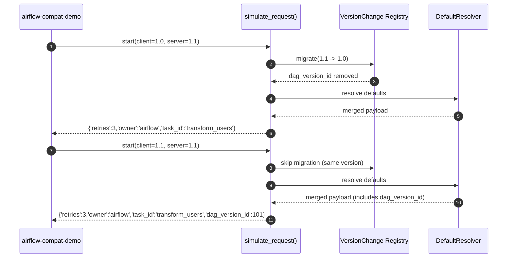

# airflow-compat-demo 전체 실행 및 내부 동작 정리

이 문서는 `airflow-compat-demo` CLI를 실행했을 때 내부적으로 어떤 코드가 실행되고,  
어떤 원리로 **VersionChange**와 **DefaultResolver**가 동작하는지를 한눈에 설명합니다.  

---

## 🧩 개요

이 프로젝트는 Airflow 3.x의 핵심 아이디어인  
**Task SDK ↔ Core 간의 버전 호환성(Versioned Contract)** 과  
**Default Value Precedence (기본값 우선순위)** 개념을 단순화한 예제입니다.

CLI 명령:

```bash
airflow-compat-demo
```

출력 예시:

```
[Response for SDK v1.0] {'retries': 3, 'owner': 'airflow', 'task_id': 'transform_users'}
[Response for SDK v1.1] {'retries': 3, 'owner': 'airflow', 'task_id': 'transform_users', 'dag_version_id': 101}
```

---

## ⚙️ 실행 흐름 요약

```
airflow-compat-demo (CLI entry)
 └── airflow_compat_demo.cli.main()
      ├── simulate_request("1.0", "1.1")
      │     ├── TaskInstanceV11 생성
      │     ├── VersionChange 적용 → dag_version_id 제거
      │     ├── DefaultResolver 병합 → 기본값 병합
      │     └── v1.0 호환 JSON 반환
      ├── simulate_request("1.1", "1.1")
      │     ├── 변환 없음 (같은 버전)
      │     ├── DefaultResolver 병합
      │     └── v1.1 JSON 반환
      └── 두 결과 출력
```

---

## 🧠 구성 파일 및 역할

| 파일 | 역할 |
|------|------|
| `cli.py` | CLI 진입점, `simulate_request()` 정의 |
| `models.py` | TaskInstance 데이터 모델 정의 |
| `versioning.py` | `VersionChange`, `VersionRegistry` 구현 |
| `defaults.py` | `DefaultResolver` (기본값 병합 로직) |
| `pyproject.toml` | CLI 엔트리포인트 정의 (`airflow-compat-demo = airflow_compat_demo.cli:main`) |

---

## 1️⃣ CLI Entry Point

```toml
[project.scripts]
airflow-compat-demo = "airflow_compat_demo.cli:main"
```

- `pip install -e .` 시 이 엔트리포인트가 PATH에 등록됩니다.
- 터미널에서 `airflow-compat-demo` 입력 시 `main()` 함수가 실행됩니다.

---

## 2️⃣ CLI Main Function

```python
def main():
    res_10 = simulate_request("1.0", "1.1")
    print("[Response for SDK v1.0]", res_10)

    res_11 = simulate_request("1.1", "1.1")
    print("[Response for SDK v1.1]", res_11)
```

두 번 호출됨:
- **서버 1.1 → 클라이언트 1.0:** 변환 필요  
- **서버 1.1 → 클라이언트 1.1:** 변환 불필요

---

## 3️⃣ simulate_request() 내부 로직

```python
def simulate_request(client_version="1.0", server_version="1.1"):
    ti = TaskInstanceV11(task_id="transform_users", dag_version_id=101)
    raw = asdict(ti)
    migrated = registry.migrate(raw, from_version=server_version, to_version=client_version)

    resolver = DefaultResolver(
        schema_defaults={"retries": 1, "owner": "airflow"},
        client_defaults={"owner": "sdk_client"},
        dag_defaults={"retries": 2},
        partial_args={"owner": "dag_owner"},
    )
    final = resolver.resolve(task_values=migrated)
    return final
```

**요약 흐름**
| 단계 | 설명 |
|------|------|
| ① | 서버(v1.1) TaskInstance 생성 (`dag_version_id` 포함) |
| ② | `VersionChange`로 클라이언트(v1.0)에 맞게 변환 (`dag_version_id` 제거) |
| ③ | `DefaultResolver`를 통해 default 병합 |
| ④ | 최종 JSON 반환 |

---

## 4️⃣ VersionChange 구조

`versioning.py`:

```python
@dataclass
class VersionChange:
    from_version: str
    to_version: str
    description: str
    apply: Callable[[Dict[str, Any]], Dict[str, Any]]
```

**등록된 변환 규칙**

```python
def _remove_dag_version_id(payload):
    payload = dict(payload)
    payload.pop("dag_version_id", None)
    return payload

registry.register(
    VersionChange(
        from_version="1.1",
        to_version="1.0",
        description="Remove dag_version_id for backward compatibility",
        apply=_remove_dag_version_id,
    )
)
```

➡️ 서버에서 v1.1 → v1.0 응답 변환 시 `dag_version_id` 필드를 제거합니다.

---

## 5️⃣ DefaultResolver 병합 우선순위

`defaults.py` 핵심:

```python
class DefaultResolver:
    def resolve(self, task_values):
        merged = {}
        merged.update(self.schema_defaults)  # 1️⃣
        merged.update(self.client_defaults)  # 2️⃣
        merged.update(self.dag_defaults)     # 3️⃣
        merged.update(self.partial_args)     # 4️⃣
        merged.update(task_values)           # 5️⃣
        return merged
```

| 우선순위 | 계층 | 설명 | 예시 |
|-----------|------|------|------|
| 1️⃣ | Schema defaults | Airflow 내장 기본값 | `{"retries": 1, "owner": "airflow"}` |
| 2️⃣ | Client defaults | SDK 기본값 | `{"owner": "sdk_client"}` |
| 3️⃣ | DAG defaults | DAG-level default_args | `{"retries": 2}` |
| 4️⃣ | Partial args | 공유 연산자 설정 | `{"owner": "dag_owner"}` |
| 5️⃣ | Task explicit values | 명시적 Task 값 (최우선) | `task_id`, `retries`, `owner` 등 |

---

## 6️⃣ 실제 출력 결과 이유

| 필드 | v1.0 출력 | v1.1 출력 | 이유 |
|------|------------|------------|------|
| `dag_version_id` | ❌ 없음 | ✅ 있음 | `VersionChange`에 의해 제거됨 |
| `retries` | `3` | `3` | TaskInstance 명시값이 최우선 |
| `owner` | `"airflow"` | `"airflow"` | TaskInstance 명시값이 최우선 |

---

## 7️⃣ 전체 동작 시퀀스 다이어그램



---

## 8️⃣ 실제 Airflow 개념과의 매핑

| airflow-compat-demo 구성 | 실제 Airflow 대응 개념 |
|---------------------------|--------------------------|
| `VersionChange` | Task SDK ↔ Core 간 API Contract 변화 관리 |
| `DefaultResolver` | DAG Serialization 시 Default 병합 로직 |
| `simulate_request()` | Task Execution API 요청/응답 처리 |
| `registry` | Airflow 내부의 Versioned Contract Registry |
| `dag_version_id` | Airflow 3.x DAGVersion 메타데이터 키 |

---

## ✅ 결론

이 예제는 Airflow의 핵심 진화 개념을 코드 단위로 재현합니다:

1. **Versioned Contract** —  
   SDK, Scheduler, API Server를 독립적으로 업그레이드할 수 있도록 버전 간 변환(`VersionChange`)을 정의.

2. **DefaultResolver** —  
   DAG 직렬화 과정에서 다양한 레벨의 default 값을 정해진 우선순위로 병합.

3. **독립성 확보** —  
   Server와 SDK가 서로 다른 릴리즈 타이밍이라도,  
   `VersionChange` + `DefaultResolver` 조합으로 완전한 호환성을 유지할 수 있음.

---

## 📘 전체 요약

| 구성요소 | 역할 | Airflow 3.x 대응 |
|-----------|------|----------------|
| TaskInstanceV11 | DAG 직렬화된 Task 객체 | SerializedDAG 내부 Task 구조 |
| VersionChange | 버전별 Schema 차이 정의 | `dag-serialization/v2.json` 변경 대응 |
| VersionRegistry | 버전 간 변환 레이어 관리 | Task Execution API Contract |
| DefaultResolver | Default 병합 엔진 | DAG DefaultArgs / Operator / SDK Default 통합 |
| simulate_request | end-to-end 요청 흐름 시뮬레이션 | Scheduler ↔ SDK 교신 |
| CLI (airflow-compat-demo) | 테스트 엔트리포인트 | Breeze 기반 CLI 시뮬레이터 |

---

## 🧩 핵심 메시지

> Airflow 3.x는 DAG Serialization, Task SDK, Scheduler, API Server 간에  
> “Versioned Contract” 구조를 두어,  
> 각각의 컴포넌트가 **독립적으로 배포 및 업그레이드**되면서도  
> **완전한 호환성(Forward + Backward Compatibility)** 을 유지한다.  
>
> `airflow-compat-demo`는 이 원리를 Python 단일 패키지로 실습할 수 있는 축약판이다.

---


## Quickstart (with uv)

```bash
# Inside this folder
uv venv
source .venv/bin/activate
uv pip install -e .
airflow-compat-demo  # run the CLI demo
```

## Run Tests

```bash
uv pip install pytest
pytest
```
