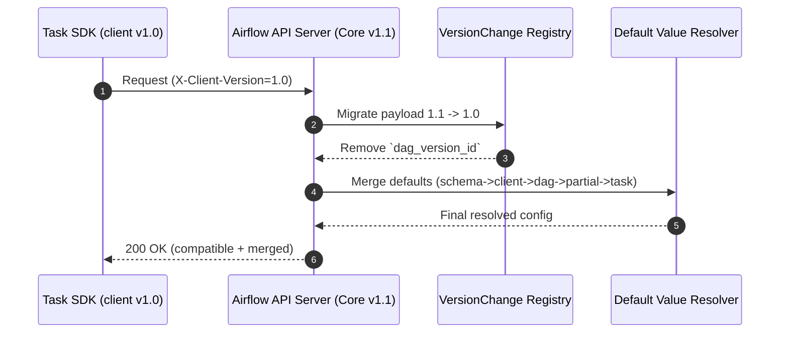

```mermaid
sequenceDiagram
    autonumber
    participant SDK as Task SDK (client v1.0)
    participant API as Airflow API Server (Core v1.1)
    participant VC as VersionChange Registry
    participant DV as Default Value Resolver

    SDK->>API: Request (X-Client-Version=1.0)
    API->>VC: Migrate payload 1.1 -> 1.0
    VC-->>API: Remove `dag_version_id`
    API->>DV: Merge defaults (schema->client->dag->partial->task)
    DV-->>API: Final resolved config
    API-->>SDK: 200 OK (compatible + merged)
```
